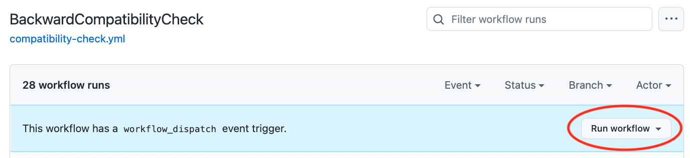
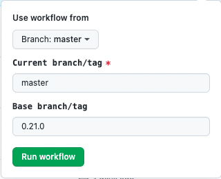
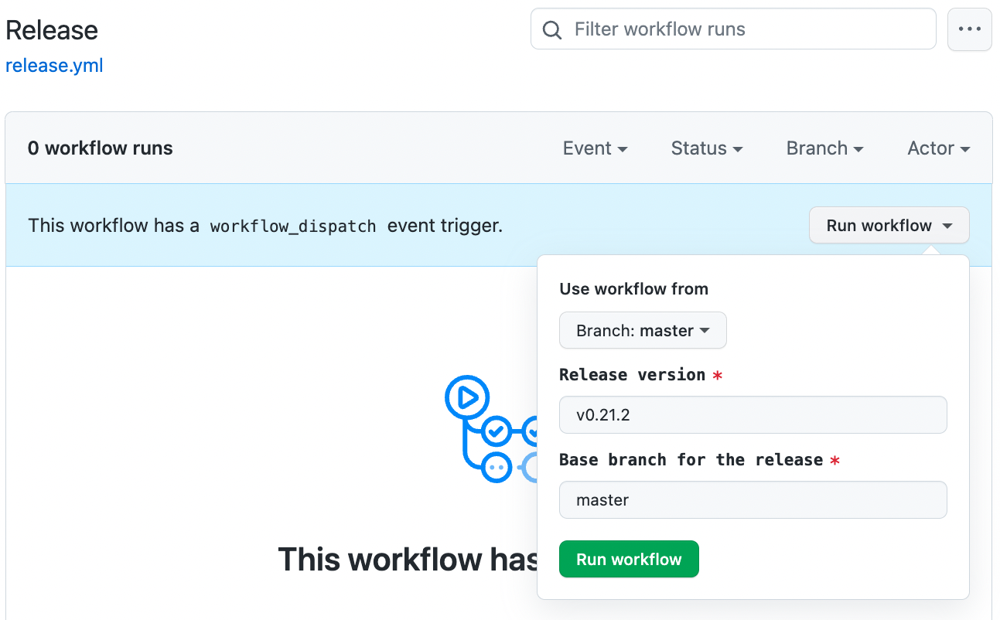

# Release Process

Assume releasing Cadence version `v0.21.2` from `master` branch. 
Also, assume the latest deployed version on the live networks is `v0.21.0`.

## Using GitHub Actions

Cadence repo provides a set of useful [GitHub actions](https://github.com/onflow/cadence/actions) that can be used to
release a new version of Cadence.

### Checking backward compatibility

Certain Cadence versions are not supposed to have any breaking changes.
This step ensures the version that is going to be released does not contain such changes.

_If it is acceptable to have breaking changes in the new version, you may skip this step and proceed to the [releasing](#releasing)
step._

Check for breaking changes can be done using the [BackwardCompatibilityCheck](https://github.com/onflow/cadence/actions/workflows/compatibility-check.yml)
github action.


 
Run the workflow by providing `master` as the `Current branch/tag` and `v0.21.0` which is the latest deployed version
on the live networks, as the `Base branch/tag`.
Since the release would be based on the current master branch, the compatibility check would compare the current `master` 
branch against `v0.21.0` branch/tag.



⚠️ _Note: The compatibility checker is sensitive to error messages. 
Thus, if there are error message changes in the current code, the workflow will fail.
You would then have to manually inspect the workflow output (diff) and determine whether the difference in output is
only due to the error messages, or are there any other differences in the reported errors._

### Releasing

Releasing a new version of Cadence can be easily done by using the [Release GitHub action](https://github.com/onflow/cadence/actions/workflows/release.yml)
Run the workflow by providing `0.21.2` (note the version is without `v`) as the `Release version` and `master` as the
`Base branch`.



If everything goes well, this will create and push a new tag `v0.21.2` for the release.

It'll also create a new branch `release/v0.21.2` on the repo and a PR to merge the version bump changes to the
base branch (`master` in this case).


## Manual Steps

⚠️ _It is highly recommended to use the [GitHub actions](#using-github-actions) for releasing a new Cadence version._

### Checking backward compatibility

- Checkout the current branch (`master`) 
  ```
  git checkout master
  ```
- Create a `tmp` directory to store outputs.
  ```
  mkdir tmp
  ```
- Download contracts for **mainnet**, by running the batch-script tool.
  ```
  cd ./tools/batch-script
  go run ./cmd/get_contracts/main.go --chain=flow-mainnet --u=access.mainnet.nodes.onflow.org:9000 > ../../tmp/mainnet_contracts.csv
  cd ../..
  ```
- Check the contracts using the current branch.
  This will write the parsing and checking errors to the `tmp/mainnet_output_new.txt` file.
  ```
  cd ./tools/compatibility-check
  go run ./cmd/check_contracts/main.go ../../tmp/mainnet_contracts.csv ../../tmp/mainnet_output_new.txt
  ```
- Checkout the Cadence version that is currently deployed on networks (`v0.21.0`), and repeat the previous step.
  ```
  git checkout v0.21.0
  go run ./cmd/check_contracts/main.go ../../tmp/mainnet_contracts.csv ../../tmp/mainnet_output_old.txt
  cd ../..
  ```
- Compare the diff between the two outputs.
  ```
  cd ./tools/compatibility-check
  go run ./cmd/check_diff/main.go ../../tmp/output-old.txt ../../tmp/output-new.txt
  ```
- If there is a difference in the errors reported, then there are potential breaking changes.
- Repeat the same steps for **testnet** as well. Use `--chain=flow-testnet --u=access.testnet.nodes.onflow.org:9000`
  flags when running the `go run ./cmd/get_contracts/main.go` command.

If it is deemed that there are no breaking changes, proceed to the [Releasing](#releasing-1) steps.

### Releasing

- Checkout the base branch.
  ```
  git checkout master
  ```
- Create a release branch.
  ```
  git checkout -b release/v0.21.2
  ```
- Update the version numbers in the code.
  ```
  make release bump=0.21.2
  ```
- Run tests and linter. Ensure they pass successfully.
  ```
  make test && make lint
  ```
- Commit the changes with message `v0.21.2`
  ```
  git commit -m "v0.21.2"
  ```
- Create a new tag `v0.21.2` and push to the remote repo.
  ```
  git tag v0.21.2 && git push origin v0.21.2
  ```
- Push the release branch `release/v0.21.2` that contains the version bump changes.
  ```
  git push origin release/v0.21.2
  ```
- Finally, open a PR from `release/v0.21.2` branch to the base branch (`master` in this case),
  to include the version bump changes.