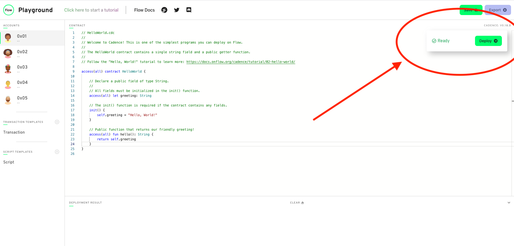

In this tutorial, we'll write and deploy our first smart contract!

<Callout type="success">
  Open the starter code for this tutorial in the Flow Playground: <br />
  <a
    href="https://play.onflow.org/dbc06b40-d0b1-42da-9e0d-686bc9972e65"
    target="_blank"
  >
    https://play.onflow.org/dbc06b40-d0b1-42da-9e0d-686bc9972e65
  </a>
  <br />
  The tutorial will ask you to take various actions to interact with this code.
</Callout>
<Callout type="info">
  Instructions that require you to take action are always included in a callout
  box like this one. These highlighted actions are all that you need to do to
  get your code running, but reading the rest is necessary to understand the
  language's design.
</Callout>

## What is a smart contract?

In regular terms, a contract is an agreement between two parties for some exchange of information or assets.
Normally, the terms of a contract are supervised and enforced by a trusted third party, such as a bank or a lawyer.

A smart contract is a computer program stored in a decentralized network like a blockchain
that verifies and executes the performance of a contract (like a lawyer does)
without the need for any trusted third party anywhere in the process, because the code itself is trusted.

Programs that run on blockchains are commonly referred to as smart contracts
because they mediate important functionality (such as currency) without having to rely on a central authority (like a bank).

[Cadence is the resource-oriented programming language](/cadence)
for developing smart contracts on the Flow Blockchain.

This tutorial will walk you through an example of a smart contract that implements basic Cadence features,
including accounts, transactions, and signers.

Our "Hello World" smart contract will:
1. Create and initialize a smart contract with a single field of type `String`
2. Initialize the field with the phrase "Hello, World!"
3. Create a function in the contract that returns our greeting

We will deploy this contract in an account, then use a transaction to interact with the contract,
and finally discuss the role of signers in the transaction.

## Follow Along!
Before we get started if you'd prefer to learn from a video, feel free to join Kim
as she walks you through the basics of accounts, smart contracts, Cadence, transactions & more!

<iframe width="560" height="315" src="https://www.youtube.com/embed/pRz7EzrWchs" title="YouTube video player" frameborder="0" allow="accelerometer; autoplay; clipboard-write; encrypted-media; gyroscope; picture-in-picture" allowfullscreen></iframe>

## How to Use Playground

For this tutorial, you'll be using the [Flow Playground](https://play.onflow.org/local-project),
an interactive web interface that lets you write and run smart contracts in a test environment.
It also allows you to save and share your work with others so that you can test smart contracts collaboratively.

When you work with accounts in the Flow Playground, you start with five default accounts that you can change and reconfigure.
Each account in your environment has a unique address, and you can select an account in the left toolbar,
which will open up the contract that is saved for that account.

For this tutorial, you'll be working with only the first account `0x01`

## Implementing Hello World
---

You will start by writing a smart contract that contains a public function that returns `"Hello World!"`.

Like most other blockchains, the programming model in Flow is centered around accounts and transactions.
All state that persists permanently is stored in [accounts](/cadence/language/accounts)
and all accounts have the same core functionality. (users, smart contracts, data storage)

The interfaces to this state (the ways to interact with it, otherwise known as methods or functions) are also stored in accounts.
All code execution takes place within [transactions](/cadence/language/transactions),
which are blocks of code that are authorized and submitted by external users
to interact with the persistent state, which includes directly modifying account storage.

A smart contract is a collection of code (its functions) and data (its state) that lives in the contract area of an account in Flow.
Each account can have zero or more contracts and/or contract interfaces.
A contract can be freely added, removed, or updated (with some restrictions) by the owner of the account.
Now let's look at the `HelloWorld` contract that you'll be working through in this tutorial.

<Callout type="info">

If you haven't already, you'll need to follow this link to open a playground session with the Hello World contracts, transactions, and scripts pre-loaded:

  <a
    href="https://play.onflow.org/dbc06b40-d0b1-42da-9e0d-686bc9972e65"
    target="_blank"
  >
    https://play.onflow.org/dbc06b40-d0b1-42da-9e0d-686bc9972e65
  </a>

</Callout>


<Callout type="info">

Open the Account `0x01` tab with the file called
`HelloWorld.cdc`. <br />
`HelloWorld.cdc` should contain this code:

</Callout>

```cadence:title=HelloWorld.cdc
// HelloWorld.cdc
//
pub contract HelloWorld {

    // Declare a public field of type String.
    //
    // All fields must be initialized in the init() function.
    pub let greeting: String

    // The init() function is required if the contract contains any fields.
    init() {
        self.greeting = "Hello, World!"
    }

    // Public function that returns our friendly greeting!
    pub fun hello(): String {
        return self.greeting
    }
}
```

The line `pub contract HelloWorld ` declares a contract that is accessible in all scopes (public).
It's followed by `pub let greeting: String` which declares a state constant (`let`) of type `String` that is accessible in all scopes(`pub`).

You would have used `var` to declare a variable, which that the value can be changed later on instead of remaining constant like with `let`.

You can use `access(all)` and the `pub` keyword interchangeably.
They are both examples of an access control specification that means an interface can be accessed in all scopes, but not written to in all scopes.
For more information about the different levels of access control permitted in Cadence, refer to the [Access Control section of the language reference](/cadence/language/access-control).

The `init()` section is called the initializer. It is a special function that only runs when the contract is first created.
Objects similar to contracts, such as other [composite types like structs or resources](/cadence/language/composite-types),
require that the `init()` function initialize any fields that are declared in a composite type.
In the above example, the initializer sets the `greeting` field to `"Hello, World!"` when the contract is initialized.

The last part of our `HelloWorld` contract is a public function called `hello()`.
This declaration returns a value of type `String`.
Anyone who imports this contract in their transaction or script can read the public fields,
use the public types, and call the public contract functions; i.e. the ones that have `pub` or `access(all)` specified.

Soon you'll deploy this contract to your account and run a transaction that calls its function, but first, let's look at what accounts and transactions are.

### Accounts and Transactions

---
#### What is an Account?

Each user has an account controlled by one or more private keys with configurable weight.
This means that support for accounts/wallets with [multiple controllers](https://www.coindesk.com/what-is-a-multisignature-crypto-wallet)
is built into the protocol by default.

An account is divided into two main areas:

1. The first area is the [contract area](/cadence/language/accounts).
   This is the area that stores smart contracts containing type definitions, fields, and functions that relate to common functionality.
   There is no limit to the number of smart contracts an account can store.
   This area cannot be directly accessed in a transaction unless the transaction is just returning (reading) a copy of the code deployed to an account.
   The owner of an account can directly add, remove, or update/overwrite contracts that are stored in it.

2. The second area is the account storage.
   This area is where an account stores the objects that they own.
   This also stores code that declares the capabilities for controlling how these stored objects can be accessed.
   We'll cover account storage in more detail in a later tutorial.

In this tutorial, we use the account with the address `0x01` to store our `HelloWorld` contract.
Outside the Playground context, account addresses on Flow are completely unique.

### Deploying Code

---

Now that you know what an account is in a Cadence context, you can deploy the `HelloWorld` contract to your account.

<Callout type="info">

Make sure that the account `0x01` tab is selected and that the
`HelloWorld.cdc` file is in the editor. <br />
Click the deploy button to deploy the contents of the editor to account `0x01`.

</Callout>



You should see a log in the output area indicating that the deployment succeeded.

    Deployed Contract To: 0x01

You'll also see the name of the contract show up in the selected account tab underneath the number for the account.
This indicates that the `HelloWorld` contract has been deployed to the account.
You can always look at this tab to verify which contracts are in which accounts.
In the Flow Playground environment there can only be one contract for each account.

### Creating a Transaction
---

A [Transaction](/cadence/language/transactions) in Flow is defined as an arbitrary-sized block of Cadence code that is authorized by one or more accounts.
When an account authorizes a transaction, the code in that transaction has access to the authorizers' private storage.
An account authorizes a transaction by performing a cryptographic signature on the transaction with the account's private key,
which should only be accessible to the account owner. Therefore, authorizers are also known as signers.
In addition to being able to access the authorizer's private assets,
transactions can also read and call functions in public contracts, and access public domains in other users' accounts.
For this tutorial, we use a transaction to call our `hello()` function.

<Callout type="info">

Open the transaction named `Simple Transaction` <br />
`Simple Transaction` should contain this code:

</Callout>

```cadence:title=SayHello.cdc
import HelloWorld from 0x01

transaction {

  prepare(acct: AuthAccount) {}

  execute {
    log(HelloWorld.hello())
  }
}

```

This transaction first imports our `HelloWorld` smart contract from the account `0x01`.
If you haven't deployed the smart contract from the account, the transaction won't have access to it and the import will fail.
This imports the entire contract code from `HelloWorld`, including type definitions and public functions,
so that the transaction can use them to interact with the `HelloWorld` contract in account `0x01`.

To import a smart contract from any other account, type this line at the top of your transaction:

```cadence
// Replace {ContractName} with the name of the contract you want to import
// and {Address} with the account you want to import it from
import {ContractName} from {Address}
```

Transactions are divided into two main phases, `prepare` and `execute`.

1. The `prepare` phase is required but we don't use it in this tutorial.
We'll cover this phase in a later tutorial.
2. The `execute` phase is the main body of a transaction.
It can call functions on external contracts and objects and perform operations on data that was initialized in the transaction.
In this example, the `execute` phase calls `HelloWorld.hello()` which calls the `hello()` function in the `HelloWorld` contract and logs the result(`log(HelloWorld.hello())`) to the console.

<Callout type="info">

In the box at the top right of the editor, select Account `0x01` as the transaction signer. <br />
Click the `Send` button to submit the transaction

</Callout>

You should see something like this in the transaction results at the bottom of the screen:

```
Simple Transaction "Hello, World!"
```

Congratulations, you just executed your first Cadence transaction with the account `0x01` as the signer.

In this tutorial, you'll get the same result if you use different signers for the transaction
but later tutorials will use more complex examples that have different results depending on the signer.

## Reviewing HelloWorld

This tutorial covered an introduction to Cadence, including terms like accounts, transactions, and signers.
We implemented a smart contract that is accessible in all scopes.
The smart contract had a `String` field initialized with the value `Hello, World!` and a function to return (read) this value.
Next, we deployed this contract in an account and implemented a transaction to call the function in the smart contract and log the result to the console.
Finally, we used the account `0x01` as the signer for this transaction.

Now that you have completed the tutorial, you have the basic knowledge to write a simple Cadence program that can:
- Deploy a basic smart contract in an account
- Interact with the smart contract using a transaction
- Sign the transaction with one or multiple signers

Feel free to modify the smart contract to implement different functions,
experiment with the available [Cadence types](/cadence/language/values-and-types),
and write new transactions that execute multiple functions from your `HelloWorld` smart contract.
